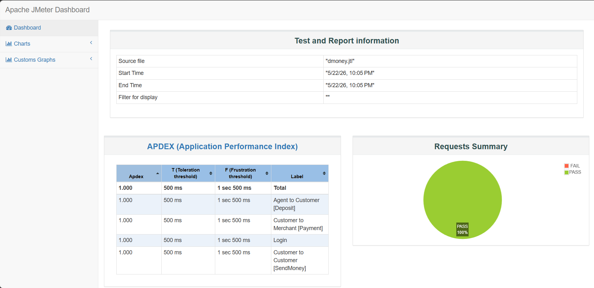
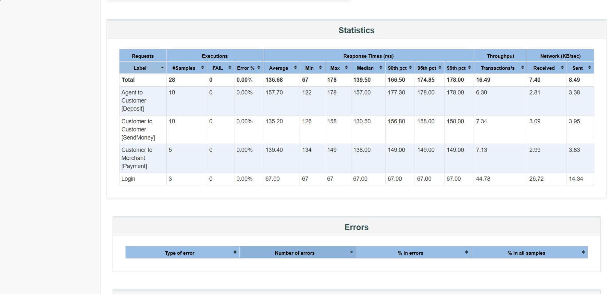

# Dmoney Performance Testing with Apache JMeter

## Project Overview

This project demonstrates an end-to-end API Chaining and Performance Testing framework developed using Apache JMeter for the Dmoney system.

The test suite simulates realistic financial operations — including deposits, send money, and payments — by chaining multiple APIs with dynamic token management and shared transaction data. 

It performs load testing with concurrent users (5 agents and 5 customers) to measure key performance metrics such as response time, throughput, error rate, and system stability under load.

---

## Project Structure

| File / Folder | Description |
|---------------|-------------|
| `dmoney.jmx` | Complete JMeter API chaining test plan |
| `deposit.csv` | Deposit transaction test data |
| `sendMoney.csv` | Sender and receiver account data |
| `payment.csv` | Merchant payment data |
| `dashboard/index.html/` | Generated JMeter HTML reports |
| `screenshots/` | Execution and report screenshots |

---

## Test Architecture

The test plan is designed with multiple interconnected thread groups to mimic realistic user activity within the Dmoney system.

**Admin Login**
- Generates authentication token
- Token stored dynamically using JSON Extractor

**Deposit Operations**
- Agents perform deposits for customers
- Shared authorization token reused across requests

**Send Money Operations**
- Customers transfer money between accounts
- Dynamic sender and receiver data loaded from CSV

**Merchant Payment Operations**
- Customers complete payments to merchants
- Final transaction validation performed

---

## Key Features

- End-to-end API chaining implementation  
- Dynamic token extraction and reuse  
- Data-driven testing using CSV files  
- Automated response validation  
- Realistic transaction simulation  
- Modular and scalable JMeter architecture  
- HTML report generation with execution analytics  

---

## API Chaining Logic
- Login as Admin → Extract Token
- Use Token in Header → Start Deposit Thread Group
- Continue to SendMoney Thread Group
- Complete with Payment Thread Group
- All requests assert success response (200 OK + expected message)

---

## Tools & Technologies

| Technology / Tool | Purpose |
|-------------------|---------|
| **Apache JMeter** | API testing and chaining execution |
| **CSV Data Set Config** | Dynamic test data management |
| **JSON Extractor** | Token extraction and variable reuse |
| **HTTP Header Manager** | Authorization token handling |
| **Response Assertions** | Validation of API responses |
| **HTML Dashboard Report** | Execution summary and analytics |

---

## Report Screenshots

Below are sample screenshots from the generated JMeter HTML report:

---

Experience & Insights Gained

- Designed and executed end-to-end API chaining workflows using Apache JMeter for the Dmoney financial system.
- Implemented multi-user performance testing with concurrent agents and customers for Deposit, Send Money, and Payment scenarios.
- Managed dynamic token extraction and reuse across multiple Thread Groups for secure API authentication.
- Performed data-driven testing using CSV datasets and Random Variable Controller for realistic transaction simulation.
- Validated transaction success with Response Assertions and generated detailed performance reports.
- Gained hands-on experience in load testing, thread management, and analyzing key performance metrics like response time and throughput.

---
## Author

**Farhad Nuri**

---